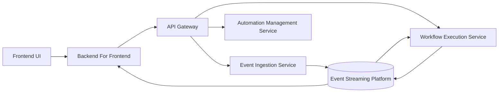
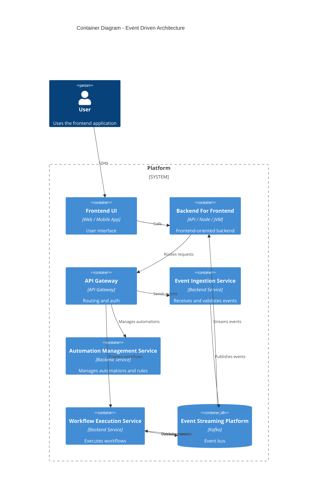

# Hybrid Communication Model (Synchronous APIs + Event-Driven Workflows)

| Field            | Value |
|------------------|-------|
| **ADR**          | ADR-0001 |
| **Author**       | Marcio Dias |
| **Contributors** | N/A |
| **Started at**   | 2026-01-08 |
| **Status**       | DONE |
| **Description**  | This ADR documents the decision to adopt a hybrid communication model in EventFlow, combining synchronous APIs for user-driven interactions with asynchronous, event-driven communication for workflow execution and state propagation. |

## Context

EventFlow is an automation platform where users define workflows that react to events and execute actions across systems.

The system must support:
- Interactive operations via a web frontend
- Configuration and management of automations
- Workflow executions that may be long-running
- Visibility into workflow execution progress
- Independent evolution of system components

A purely synchronous architecture would tightly couple services and increase the risk of cascading failures during workflow execution.  
A purely asynchronous or event-sourced architecture would introduce unnecessary complexity for user-facing interactions and configuration flows.

Given these constraints, EventFlow requires an architectural approach that balances usability, clarity, scalability, and decoupling.

# c4

---

## Decision

EventFlow will adopt a **hybrid communication model**, where:

- **Synchronous APIs** are used for user-facing and configuration-driven interactions
- **Asynchronous, event-driven communication** is used for workflow execution, background processing, and state propagation

Both communication styles are considered first-class and are applied based on the nature of the interaction rather than enforcing a single architectural paradigm.

---

## Consequences

### Positive Consequences

- Clear separation between user-driven interactions and execution-driven workflows
- Improved fault isolation during workflow execution
- Increased flexibility to evolve services independently
- Realistic architecture aligned with industry practices
- Strong foundation for automation and event-based processing

### Negative Consequences

- Increased architectural complexity compared to a single communication model
- Need to reason about consistency across synchronous and asynchronous boundaries
- Additional operational overhead associated with event streaming infrastructure

These trade-offs are accepted as part of the system’s design and learning objectives.

---

## Alternatives

### Fully Synchronous Architecture

All services communicate exclusively through synchronous APIs.

**Rejected because:**
- High coupling between services
- Poor fault isolation
- Limited scalability for workflow execution
- Increased risk of cascading failures

---

### Fully Event-Sourced Architecture

All state changes are represented and reconstructed exclusively from events.

**Rejected because:**
- Increased cognitive complexity for user-facing flows
- Higher implementation and operational overhead
- Unnecessary complexity for a learning-oriented project

---

### Asynchronous Workflows with Minimal Synchronous APIs

Core workflows are asynchronous, with minimal synchronous endpoints.

**Rejected because:**
- Complicates frontend interactions
- Reduces clarity around interaction patterns
- Blurs responsibility boundaries between components

---

## Related

- Product Vision — EventFlow
- System Overview — EventFlow (v2)
- ADR-0002 — Backend For Frontend as an Event-Driven Projection Layer (planned)
