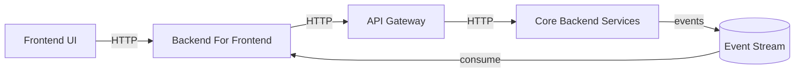
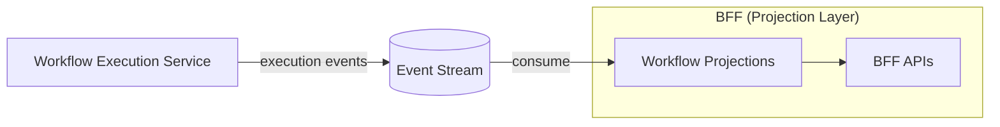
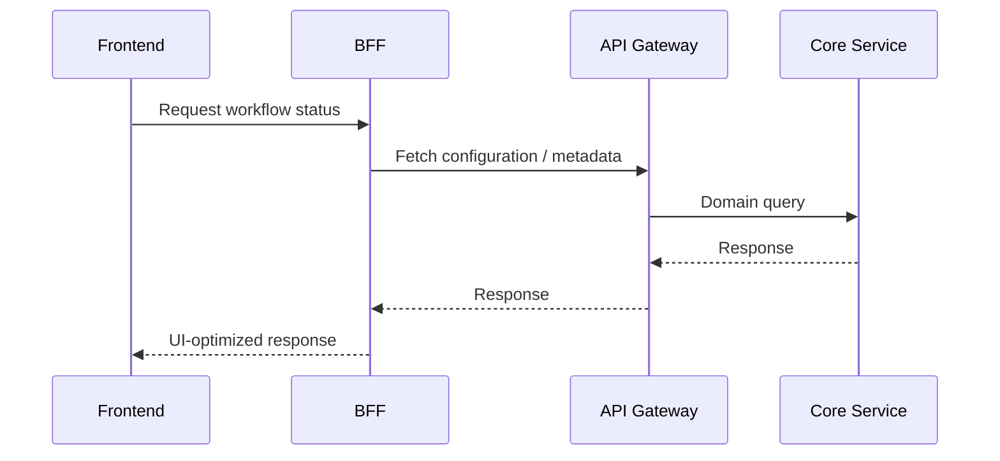
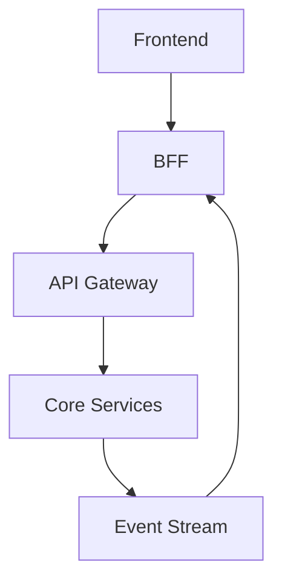

# Backend For Frontend (BFF) Architecture Diagram

## Purpose

This document provides a **visual explanation of the Backend For Frontend (BFF)** used in EventFlow.

The BFF is responsible for:
- Serving frontend-specific APIs
- Aggregating data from multiple backend services
- Consuming workflow execution events
- Maintaining **UI-oriented projections** of workflow state

The BFF is **not** a source of truth and does not execute business logic.

## Summary

The BFF acts as a frontend-oriented projection and aggregation layer, enabling:

- Clean frontend APIs

- Decoupled UI evolution

- Event-driven workflow visibility

- Clear separation between UI concerns and domain logic

---

## BFF in the System Context

The diagram below shows where the BFF sits in the overall system.

---
## Responsibilities of the BFF

The BFF has two distinct interaction modes:

- Synchronous APIs

- Serve frontend requests

- Aggregate and shape data for UI needs

- Avoid exposing domain APIs directly to the frontend

- Asynchronous Event Consumption

- Consume workflow execution events

- Build and update UI-specific projections

- Enable near real-time execution visibility

---
## BFF as a Projection Layer

The BFF maintains derived state, not authoritative state.

### Key characteristics:

Projections can be rebuilt from events

Eventual consistency is expected

Failures in the BFF do not affect execution services

---
## rontend Interaction Flow

This diagram shows how the frontend interacts with the BFF.

---
## What the BFF Does NOT Do

The BFF explicitly does not:

- Execute business logic

- Decide workflow steps

- Act as a source of truth

- Publish domain events

- Replace backend services

- All business decisions remain in core services.

---
## Dependency Direction

Allowed dependencies involving the BFF:

