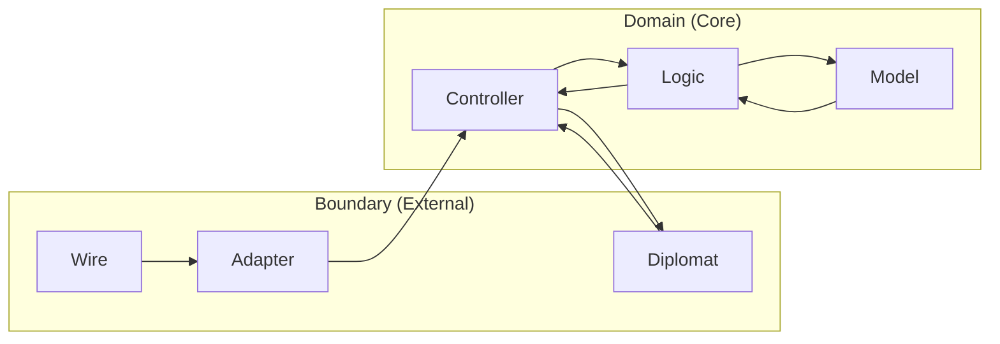
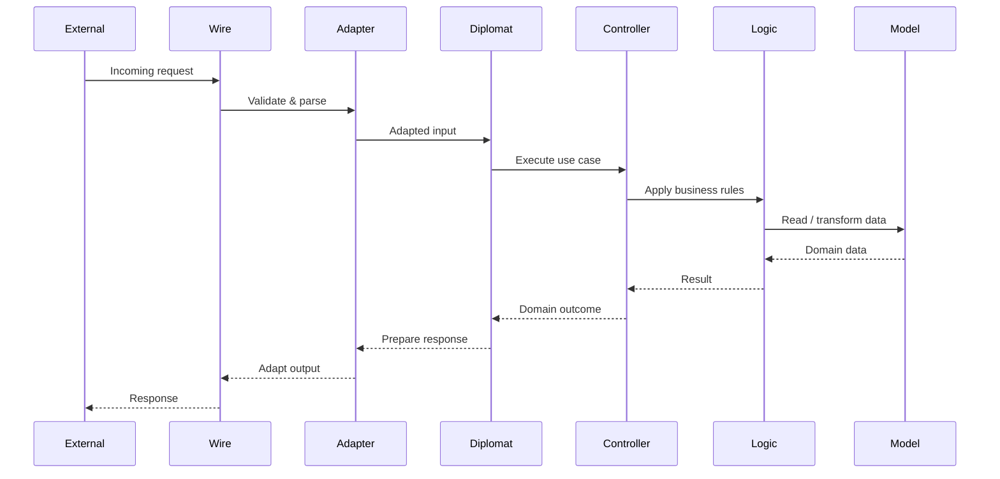
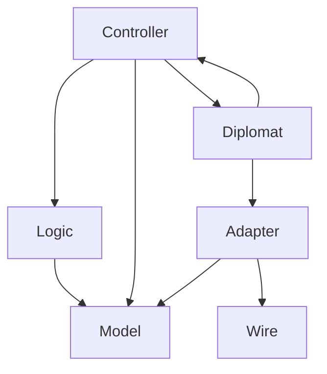

# Service Architecture Diagram

## Purpose

This document provides a **visual explanation** of the service-level architecture used in EventFlow services.

It illustrates:
- The separation between **Domain (Core)** and **Boundary (External)**
- The responsibilities of each component
- The direction of dependencies
- The flow of data through the system

This diagram complements the `service-design-principles.md` document.

---

## High-Level Architecture

The service is divided into two protected zones:

- **Domain (Core)**: business meaning and decision-making
- **Boundary (External)**: interaction with the outside world and side effects



## Request Flow (Step by Step)

The diagram below represents a typical synchronous request flow.



## Event-Based Flow (Consumer / Producer)

Event-driven interactions follow the same architectural rules.

```mermaid
flowchart LR
    EVENT[Event Stream]

    subgraph Boundary["Boundary (External)"]
        CONSUMER[Consumer (Diplomat)]
        PRODUCER[Producer (Diplomat)]
        ADAPTER2[Adapter]
    end

    subgraph Domain["Domain (Core)"]
        CONTROLLER2[Controller]
        LOGIC2[Logic]
        MODEL2[Model]
    end

    EVENT --> CONSUMER
    CONSUMER --> ADAPTER2
    ADAPTER2 --> CONTROLLER2
    CONTROLLER2 --> LOGIC2
    LOGIC2 --> MODEL2

    CONTROLLER2 --> PRODUCER
    PRODUCER --> EVENT
```

## Dependency Direction

The following diagram highlights allowed dependencies only.


## Key Takeaways

The Domain never depends on infrastructure

All side effects happen in the Boundary

Data is translated at the edges

Logic remains pure and testable

Controllers orchestrate, Logic decides

Diplomats interact with the external world

## Summary

This diagram represents the mental model behind EventFlow service design.

By enforcing strict boundaries and explicit responsibilities, services remain:

Easy to reason about

Easy to test

Easy to evolve

For detailed explanations of each component, refer to service-design-principles.md.