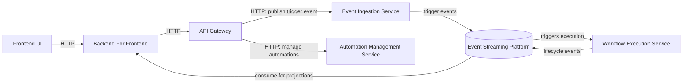
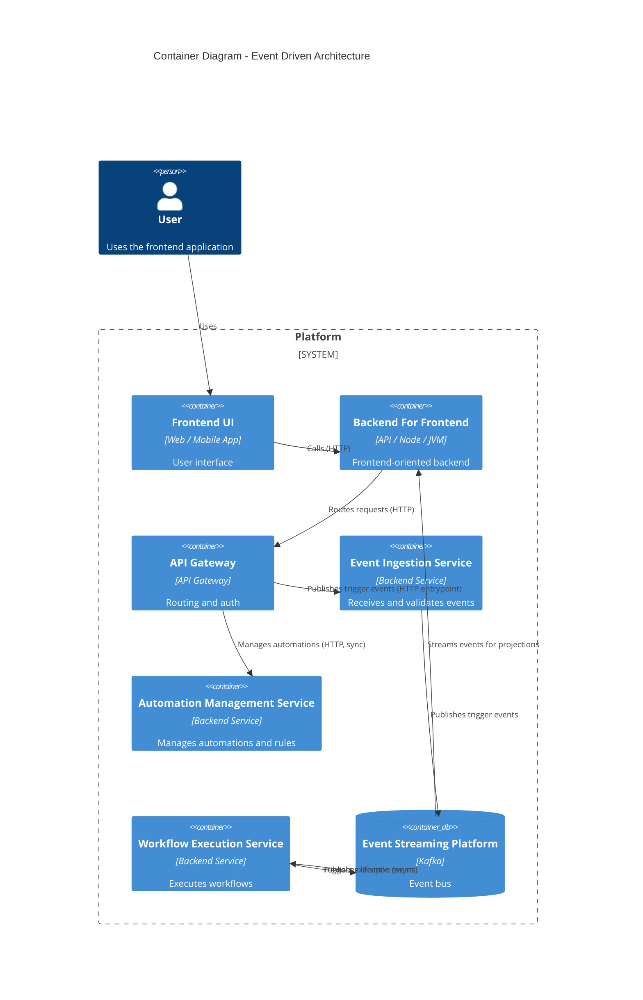

# Event-Driven Backbone (with Synchronous Edges)

| Field            | Value |
|------------------|-------|
| **ADR**          | ADR-001 |
| **Author**       | Marcio Dias |
| **Contributors** | N/A |
| **Started at**   | 2026-01-08 |
| **Status**       | ACCEPTED |
| **Description**  | This ADR documents the decision to make EventFlow **event-driven by default**: events are the backbone for action and integration between services, while synchronous APIs are a deliberate exception reserved for user-facing configuration and queries (a hybrid model with an event-driven center of gravity). |

## Context

EventFlow is an automation platform where users define workflows that react to events and execute actions across systems.

The system must support:
- Interactive operations via a web frontend
- Configuration and management of automations
- Workflow executions that may be long-running
- Visibility into workflow execution progress
- Independent evolution of system components

A purely synchronous architecture would tightly couple services and increase the risk of cascading failures during workflow execution.  
A purely asynchronous or event-sourced architecture would introduce unnecessary complexity for user-facing interactions and configuration flows.

Given these constraints, EventFlow requires an architectural approach that balances usability, clarity, scalability, and decoupling.

> Note the action path is **event-driven end to end**: the Gateway never calls the
> Workflow Execution Service directly. Execution is **triggered by a Kafka event**,
> and services integrate through events — not synchronous service-to-service calls.

# c4

---

## Decision

EventFlow adopts a **hybrid communication model with an event-driven backbone**:

- **Asynchronous, event-driven communication is the default** for everything that represents *action* and *integration between services*: triggering automations, executing workflows, and propagating state. Events are the system's **primary integration contract**.
- **Synchronous APIs are the exception**, used only for *user-facing* interactions that need immediate feedback: managing automation configuration and querying state.

Concretely, this means:

- A workflow is **triggered by an event**, never by a synchronous call. The API Gateway only forwards user intent to the Event Ingestion Service, which publishes a trigger event; the Workflow Execution Service **reacts to that event**.
- Domain services on the action path **integrate exclusively through events** — there are no direct synchronous service-to-service calls between them.
- The **only** synchronous paths are `Frontend → BFF → Gateway → {automation config, queries}`.

This keeps the event-driven model as the architectural center of gravity, while avoiding unnecessary asynchrony for simple user-facing reads and writes. It is a deliberate rejection of "synchronous-first with events bolted on": here, **events come first and synchronous calls are the narrow exception**.

---

## Consequences

### Positive Consequences

- Clear separation between user-driven interactions and execution-driven workflows
- Improved fault isolation during workflow execution
- Increased flexibility to evolve services independently
- Realistic architecture aligned with industry practices
- Strong foundation for automation and event-based processing

### Negative Consequences

- Increased architectural complexity compared to a single communication model
- Need to reason about consistency across synchronous and asynchronous boundaries
- Additional operational overhead associated with event streaming infrastructure

These trade-offs are accepted as part of the system’s design and learning objectives.

---

## Alternatives

### Fully Synchronous Architecture

All services communicate exclusively through synchronous APIs.

**Rejected because:**
- High coupling between services
- Poor fault isolation
- Limited scalability for workflow execution
- Increased risk of cascading failures

---

### Fully Event-Sourced Architecture

All state changes are represented and reconstructed exclusively from events.

**Rejected because:**
- Increased cognitive complexity for user-facing flows
- Higher implementation and operational overhead
- Unnecessary complexity for a learning-oriented project

---

### Asynchronous Workflows with Minimal Synchronous APIs

Core workflows are asynchronous, with minimal synchronous endpoints.

**Rejected because:**
- Complicates frontend interactions
- Reduces clarity around interaction patterns
- Blurs responsibility boundaries between components

---

## Related

- Product Vision — EventFlow
- System Overview — EventFlow (v2)
- ADR-002 — Backend For Frontend as an Event-Driven Projection Layer
- ADR-004 — Eventing Model & Delivery Semantics
- ADR-005 — Choreography over Orchestration
- RFC-001 — End-to-End Flow & Service Landscape
