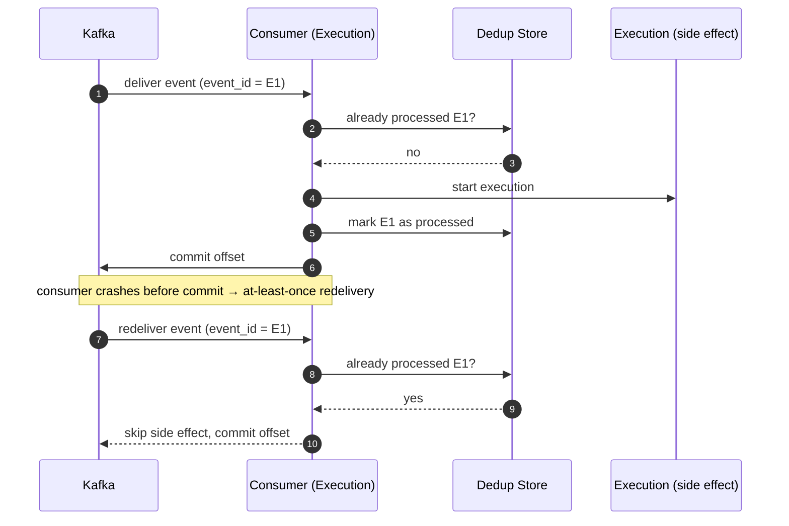
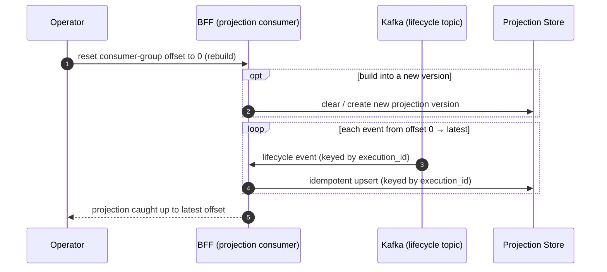

# Eventing Model & Delivery Semantics

| Field            | Value |
|------------------|-------|
| **ADR**          | ADR-004 |
| **Author**       | Marcio Dias |
| **Contributors** | N/A |
| **Started at**   | 2026-01-15 |
| **Status**       | ACCEPTED |
| **Description**  | This ADR defines how EventFlow uses events as its integration backbone: event nature, delivery guarantees, idempotency, ordering, partitioning, error handling (retry/DLQ), and projection replay. It complements the event *shapes* defined in RFC-002. |

---

## Context

In EventFlow, events are not a side channel — they are the **primary integration contract** between services and the mechanism that **triggers** workflow execution (see ADR-001 and RFC-001). Once events become the backbone, the hard problems of any event-driven system have to be answered explicitly:

- What does an event *mean* — a fact or a command?
- What delivery guarantee does the broker provide, and what must consumers tolerate?
- How do we avoid double-processing when messages are redelivered?
- How is ordering preserved, and at what granularity?
- What happens to messages that repeatedly fail to process?
- How does a read model (the BFF) recover or rebuild its state?

Leaving these implicit is the most common way an "event-driven" design quietly degrades into a fragile distributed monolith. This ADR makes the decisions explicit so they can be implemented and reviewed consistently across services.

This ADR is intentionally **broker-aware but not broker-specific**; Apache Kafka is the chosen backbone (RFC-002), and the decisions below map directly onto Kafka primitives.

---

## Decision

### 1. Events are facts, not commands

Events describe **something that already happened**, named in the past tense (`workflow_execution_completed`). Producers do not address a specific consumer; any number of consumers may react. Trigger events (e.g. `automation_trigger_requested`) represent a *request that was recorded as a fact*, not an RPC to a known service.

### 2. Delivery guarantee: at-least-once

The platform assumes **at-least-once** delivery. Messages may be **redelivered** (after consumer restarts, rebalances, or retries). Exactly-once is explicitly not relied upon (see Alternatives). Therefore, **every consumer must be idempotent**.

### 3. Idempotent consumers (dedup by `event_id`)

Consumers deduplicate using the envelope `event_id`:

- Maintain a store of processed `event_id`s (or an idempotency key derived from it).
- Processing the same `event_id` twice must produce the same result and **no duplicate side effects** (e.g. a redelivered trigger event must not start a second execution).
- Where possible, side effects are made naturally idempotent (upserts keyed by a domain id) rather than relying solely on the dedup store.

The sequence below shows why this matters: at-least-once delivery **will** redeliver after a crash, and the dedup check is what prevents a duplicate execution.

### 4. Ordering is per-key, not global

Global ordering is neither needed nor affordable. Ordering is guaranteed **per partition key**:

- The envelope `partition_key` is the Kafka message key.
- All events for the same aggregate (e.g. a given `execution_id`) share a key and therefore land on the same partition, preserving their relative order.
- Events across different aggregates may be processed concurrently and out of order — consumers must not assume cross-key ordering.

### 5. Consumer groups per role

Each independent consumer role (e.g. "execution", "bff-projection") uses its **own consumer group**, so every role receives the full stream independently. Scaling a role = adding consumers to its group; partitions bound the parallelism.

### 6. Error handling: retry with backoff, then DLQ

- Transient failures are retried with **bounded exponential backoff**.
- After exhausting retries, the message is routed to a **dead-letter topic (DLQ)** with the original envelope plus failure metadata (error, attempts, first-seen timestamp).
- The main partition is never blocked indefinitely by a single poison message.
- DLQs are monitored and support manual or automated re-drive after a fix.

### 7. Projections are replayable

The BFF (ADR-002) owns **derived, non-authoritative** state. Therefore:

- Projections can be **rebuilt from the event history** by resetting the consumer group offset and replaying.
- Projection updates are idempotent (keyed upserts), so replay is safe.
- The authoritative state remains in the producing services; losing a projection is recoverable, not catastrophic.

Rebuilding a projection is therefore an operational action, not a data-loss incident:

### 8. Tracing via `correlation_id`

A `correlation_id` is created at ingestion and **propagated unchanged** through every downstream event (trigger → lifecycle → projection), enabling a single trace across asynchronous boundaries.

### 9. Schema evolution

Event schema versioning and compatibility rules are defined in **RFC-002 — Event Contracts** (additive-compatible by default; breaking changes bump `version`; consumers ignore unknown fields; schemas live in a registry).

---

## Topic Map (v1)

| Topic | Partition key | Producer | Consumers |
|---|---|---|---|
| `automation.trigger.requested` | `automation_id` | Event Ingestion | Workflow Execution |
| `workflow.execution.lifecycle` | `execution_id` | Workflow Execution | BFF (projections) |
| `*.dlq` (per topic) | original key | platform (on failure) | operators / re-drive |

> Lifecycle events (`started`/`completed`/`failed`) share one topic keyed by `execution_id` so that, for a single execution, consumers observe them in order.

---

## Consequences

### Positive

- The genuinely hard parts of event-driven design are explicit and consistent across services
- At-least-once + idempotency is a robust, well-understood baseline
- Per-key ordering gives correctness where it matters without global-ordering cost
- DLQ + replay make the system operable and recoverable
- Correlation IDs make asynchronous flows debuggable

### Negative

- Every consumer must implement idempotency and a dedup store
- DLQ handling and re-drive add operational surface
- Per-key ordering requires careful partition-key selection (a bad key reintroduces coupling or hotspots)
- Replay requires projections to be deterministic and idempotent

These trade-offs are accepted as the cost of a real event-driven backbone.

---

## Alternatives

### Exactly-once delivery as the foundation

**Rejected because:**
- True end-to-end exactly-once across heterogeneous consumers/side effects is hard and broker-dependent
- It encourages non-idempotent consumers, which break the moment the guarantee leaks
- At-least-once + idempotency is simpler to reason about and strictly more portable

### Global ordering

**Rejected because:**
- Forces a single partition (no horizontal scale) for ordering
- Unnecessary: correctness only requires ordering per aggregate (per `execution_id`)

### No DLQ (infinite retry / drop)

**Rejected because:**
- Infinite retry blocks a partition on a poison message
- Dropping silently loses data and hides bugs
- A DLQ isolates failures while preserving the message for inspection and re-drive

### Synchronous calls for the action path

**Rejected** in ADR-001 — it reintroduces tight coupling and cascading failures and contradicts the event-driven thesis.

---

## Related

- ADR-001 — Event-Driven Backbone
- ADR-002 — Backend For Frontend as an Event-Driven Projection Layer
- ADR-003 — JavaScript Service Technology Stack
- ADR-005 — Choreography over Orchestration
- RFC-001 — End-to-End Flow & Service Landscape
- RFC-002 — Workflow Execution Service (Event Contracts)
