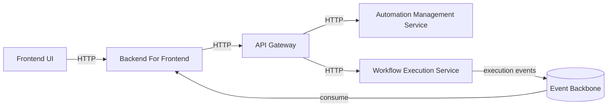

# End-to-End Flow & Service Landscape (v1)

---

| Field            | Value |
|------------------|-------|
| **RFC**          | RFC-0001 |
| **Author**       | Marcio Dias |
| **Contributors** | N/A |
| **Started at**   | 2026-01-13 |
| **Status**       | ACCEPTED |
| **Description**  | This RFC defines the end-to-end flow of EventFlow v1 and proposes an initial service landscape, establishing clear scope boundaries and a foundation for future evolution. |

---

## Context

EventFlow is an event-driven automation platform inspired by tools like Zapier, designed as a long-term learning and architectural exploration project.

Up to this point, EventFlow has:
- A defined product vision
- A system overview with synchronous and asynchronous communication
- Architectural decisions around hybrid communication and BFF usage
- Service-level design principles inspired by Diplomat architecture

What is still missing is a **clear end-to-end view of the system**, answering:

- What does EventFlow actually do in its first version?
- What is the minimal flow that delivers value?
- Which services make sense to exist from day one?
- Which services are intentionally postponed?

This RFC addresses those questions by defining the **EventFlow v1 scope** and mapping it to an initial service landscape.

---

## Goals

This RFC aims to:

- Define the functional scope of **EventFlow v1**
- Describe the **end-to-end user and system flow**
- Identify **initial service candidates** and responsibilities
- Establish a shared understanding of system boundaries
- Provide a foundation for future RFCs and milestones

---

## Non-Goals

This RFC does **not** aim to:

- Define detailed APIs or data models
- Finalize service contracts
- Optimize for performance or scale
- Lock service boundaries permanently
- Cover advanced automation features

Service definitions in this document are **directional and evolutionary**.

---

## EventFlow v1 — Functional Scope

EventFlow v1 focuses on a **minimal but complete automation loop**.

### In scope for v1

- Users can define a simple automation:
  - One triggering event
  - One or more actions
- Events can be:
  - Manually published (simulated producers)
- Automations can be:
  - Executed asynchronously
- Workflow execution emits lifecycle events:
  - Started
  - Completed
  - Failed
- Execution state is observable via the UI

### Out of scope for v1

- Complex conditional logic
- Multi-step branching workflows
- External third-party integrations
- User-defined custom code
- Advanced retry or compensation logic

---

## End-to-End Flow (v1)

At a high level, the v1 flow is:

1. A user creates an automation via the frontend
2. Automation configuration is stored
3. An event is published into the system
4. The event triggers workflow execution
5. Workflow execution emits lifecycle events
6. Execution state is projected and exposed to the UI

This flow intentionally exercises:
- Synchronous APIs (configuration, queries)
- Asynchronous processing (execution)
- Event propagation
- Observability

---

## Proposed Service Landscape (v1)

The following services are proposed for EventFlow v1.

These are **initial candidates**, not final boundaries.

---

### 1. API Gateway

**Responsibility**
- Act as the single entry point for backend services
- Handle authentication, routing, and cross-cutting concerns

**Notes**
- Thin by design
- No domain logic
- Likely to evolve as the system grows

---

### 2. Automation Management Service

**Responsibility**
- Manage automation definitions
- Store triggers and actions
- Expose CRUD APIs for automations

**Why in v1**
- Defines what can be executed
- Anchors user intent

---

### 3. Workflow Execution Service

**Responsibility**
- Execute automations when triggered
- Coordinate workflow steps
- Emit execution lifecycle events

**Why in v1**
- Core domain of the system
- Produces events consumed by other services
- Validates the event-driven architecture

---

### 4. Event Backbone (Streaming Platform)

**Responsibility**
- Transport events between services
- Decouple producers and consumers

**Notes**
- Infrastructure component
- Central to v1 execution flow

---

### 5. Backend For Frontend (BFF)

**Responsibility**
- Serve frontend-specific APIs
- Aggregate data from backend services
- Consume execution events
- Maintain UI-oriented projections

**Why in v1**
- Enables execution visibility
- Decouples UI from core services

---
## EventFlow v1 — End-to-End Architecture Diagram

## Purpose

This diagram illustrates the **end-to-end flow of EventFlow v1**, highlighting the main services involved and how synchronous and asynchronous communication coexist in the system.

It reflects the scope and service landscape defined in this RFC.

---

## High-Level System Diagram (v1)

### Flow Description

- The Frontend interacts exclusively with the BFF

- The BFF delegates configuration and command requests to the API Gateway

- The API Gateway routes requests to:

- Automation Management Service (configuration)

- Workflow Execution Service (execution commands)

- The Workflow Execution Service executes workflows asynchronously

- Execution lifecycle events are published to the Event Backbone

- The BFF consumes execution events and maintains UI-specific projections

- The Frontend queries the BFF for real-time execution status

### Notes

- The API Gateway remains thin and stateless

- The BFF does not execute business logic

- The Event Backbone decouples execution from observation

- Execution visibility is eventually consistent

This diagram represents the minimal complete loop for EventFlow v1

### Evolution

- Future versions may introduce:

- Event Ingestion Service

- External event producers

- Notification services

- Advanced workflow orchestration

- These are intentionally excluded from v1.

---

## Services Explicitly Deferred

The following services are intentionally **not part of v1**, but are expected to appear later:

- Event Ingestion Service (external producers)
- Notification Service
- Advanced Rules Engine
- External Integration Connectors

These services depend on learnings from v1 execution behavior.

---

## Dependencies & Evolution

- The Workflow Execution Service is the **domain nucleus**
- Other services evolve around execution behavior
- Gateway and BFF are expected to evolve after domain stabilization
- Event schemas are expected to change during early iterations

This RFC establishes a **learning-first architecture**, not a frozen design.

---

## Consequences

### Positive

- Clear v1 scope and expectations
- Reduced architectural ambiguity
- Strong foundation for incremental evolution
- Natural milestones for future RFCs

### Negative

- Some services may be renamed or merged later
- Initial boundaries may shift
- Some features postponed intentionally

These trade-offs are accepted to preserve focus and learning value.

---

## Related

- Product Vision — EventFlow
- System Overview — EventFlow (v2)
- ADR-0001 — Hybrid Communication Model
- ADR-0002 — Backend For Frontend as an Event-Driven Projection Layer
